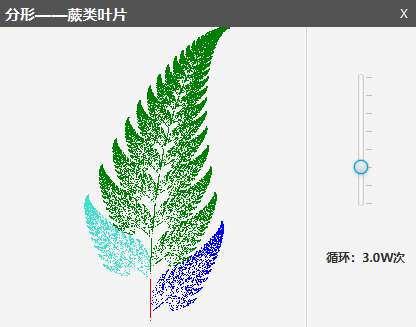
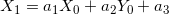
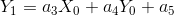

# 利用JavaFx 绘制蕨叶分形

## 1.分形绘制蕨类叶子算法

>绘制蕨类叶子分为四部分：生成左叶、右叶、主叶与枝干，各部分概率为：

* 主：85% 系数矩阵[0.85, 0.04, 0, -0.04, 0.85, 1.6] 绿色

* 右 ：%7 系数矩阵[-0.15, 0.28, 0, 0.26,0.24,0.44] 蓝色

* 左 ：%7 系数矩阵[0.2, -0.26, 0, 0.23, 0.22, 1.6] 蓝绿色

* 枝：1% 系数矩阵[0, 0, 0, 0, 0.16, 0] 红色

>每部分的更新公式都是一致的。初始坐标点X0,Y0都为1，之后根据公式

来更新，绘制不同的部分带入不同的系数即可。

>📎 [点此处下载Jar运行](./dist/fern leaf.jar)